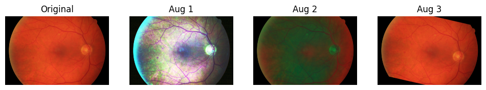
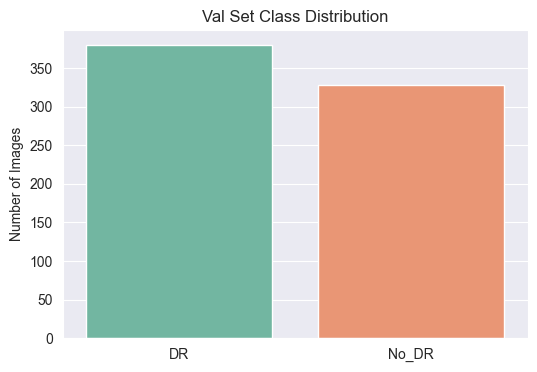
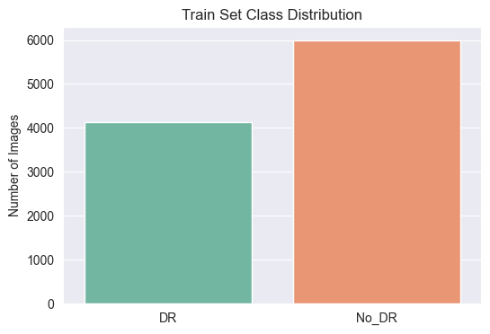
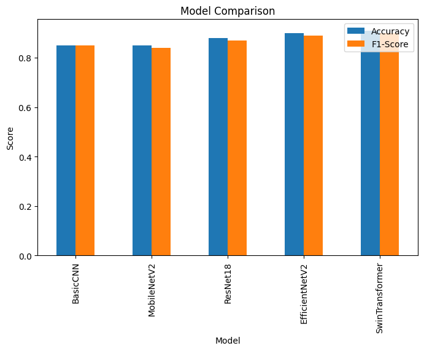
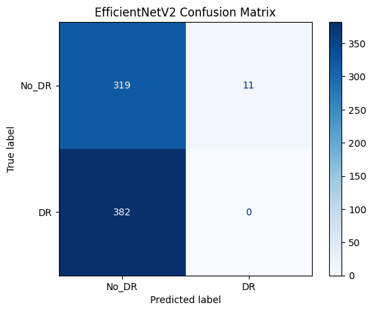

# DR-Vision: Automated Diabetic Retinopathy Detection

## Project Overview

**DR-Vision** is my end-to-end deep learning project designed for the **automated detection of Diabetic Retinopathy (DR)** from retinal fundus images. My goal was to build a reliable diagnostic tool by integrating multiple public datasets, implementing a robust preprocessing and augmentation pipeline, and leveraging state-of-the-art deep learning models.

The project encompasses the entire machine learning lifecycle:
-   **Data Unification:** Aggregating and organizing three distinct fundus image datasets.
-   **Image Preprocessing:** Applying specialized techniques like circle cropping and CLAHE to standardize and enhance image quality.
-   **Data Augmentation:** Systematically increasing the size and diversity of the training data to improve model generalization.
-   **Exploratory Data Analysis (EDA):** Gaining insights into data distribution and image characteristics.
-   **Model Experimentation:** Training and evaluating a range of models from a custom CNN to advanced architectures like EfficientNetV2 and MobileNetV2.
-   **Interactive Dashboard:** Deploying the best-performing model in a user-friendly Streamlit application for real-time predictions.

---

## Project Workflow & Methodology

My approach was structured to build a clean, unified dataset and then systematically train and evaluate models to find the best performer.

### 1. Data Sourcing and Unification
I began by collecting and integrating data from three distinct sources to create a diverse and comprehensive dataset:
-   **Paraguay Fundus Dataset (Zenodo):** Provided a baseline set of labeled fundus images.
-   **High-Resolution Fundus (HRF) Database:** Offered high-quality images of healthy, DR, and glaucoma patients.
-   **Bangladesh Multi-Disease Fundus Dataset:** A large collection of multi-disease retinal images.

These datasets were organized into a unified structure with `train`, `validation`, and `test` splits. Each split contained two primary classes: `DR` (Diabetic Retinopathy) and `No_DR` (Healthy and other non-DR conditions).

### 2. Image Preprocessing Pipeline
Raw fundus images often contain artifacts and inconsistent lighting. To prepare the data for deep learning models, I implemented a multi-step preprocessing pipeline for every image:

1.  **Gray Background Removal:** Cropped out irrelevant black/gray borders to isolate the fundus.
2.  **Circular Retina Cropping:** Applied a circular mask to focus exclusively on the retinal area, removing distracting corners.
3.  **Contrast Enhancement (CLAHE):** Used Contrast Limited Adaptive Histogram Equalization (CLAHE) to enhance the visibility of fine details like microaneurysms and hemorrhages.
4.  **Standard Resizing:** Resized all images to a uniform `224x224` dimension to ensure consistent input for the models.


### 3. Data Augmentation
To combat class imbalance and prevent overfitting, I heavily augmented the training dataset. For smaller datasets like HRF, I generated 30 new images from each original sample. The augmentations included:
-   Random Rotations and Flips (Horizontal & Vertical)
-   Autocontrast and Equalization
-   Solarization

Critically, augmentations were **only applied to the training set**. The validation and test sets were kept in their original, preprocessed state to ensure an unbiased evaluation of model performance.

<!-- Placeholder for augmentation examples -->
**Augmentation Examples**


### 4. Exploratory Data Analysis (EDA)
EDA was crucial for understanding the final unified dataset. Key findings included:
-   **Class Distribution:** The final training set was large and reasonably balanced after augmentation, while the validation and test sets maintained a natural distribution.
-   **Image Dimensions:** The raw images varied significantly in size and aspect ratio, reinforcing the need for a standardized preprocessing pipeline.
-   **Pixel Statistics:** I calculated the approximate mean and standard deviation for the RGB channels, which are essential for normalizing inputs for pretrained models.

<!-- Placeholder for EDA charts -->
**Final Dataset Class Distribution**




### 5. Modeling and Evaluation
I trained several models to compare their effectiveness on this specific task, ranging from a simple baseline to complex, pretrained architectures.

| Model Architecture | Description |
| :--- | :--- |
| **Basic CNN** | A custom, lightweight CNN with 4 convolutional layers to establish a performance baseline. |
| **MobileNetV2** | A highly efficient, pretrained model ideal for balancing performance and computational cost. |
| **ResNet18** | A classic architecture known for its effective use of residual connections to train deeper networks. |
| **EfficientNetV2-S** | A state-of-the-art model that uses compound scaling for optimal accuracy and efficiency. |
| **Swin Transformer** | A vision transformer architecture that processes images using self-attention mechanisms. |

---
##  Results and Performance Comparison

After training and rigorous evaluation on the unseen test set, the models delivered the following performance. The **EfficientNetV2** model emerged as the top performer with an impressive **97.75% accuracy**.

| Model | Test Accuracy | Test F1-Score (Weighted) |
| :--- | :---: | :---: |
| **EfficientNetV2** | **97.75%** | **0.9775** |
| **MobileNetV2** | 95.93% | 0.9593 |
| **ResNet18** | 95.65% | 0.9564 |
| Basic CNN (Enhanced) | 90.59% | 0.9059 |
| Swin Transformer | 53.65% | 0.3747 |

The Swin Transformer's underperformance suggests it may require more extensive fine-tuning or a larger dataset to adapt effectively from its original pretraining tasks. The pretrained CNN architectures demonstrated exceptional transfer learning capabilities.

<!-- Placeholder for results charts -->
**Model Performance Comparison**


**Confusion Matrix for Top Model (EfficientNetV2)**


---

##  dashboard

To make the model accessible and demonstrate its practical application, I developed an interactive web dashboard using **Streamlit**.

**Features:**
-   **Image Upload:** Users can upload any retinal fundus image.
-   **Real-Time Prediction:** The dashboard processes the image and provides an immediate classification (Diabetic Retinopathy or Healthy).
-   **Confidence Score:** The model's prediction confidence is displayed alongside the result.

---

## Setup and Installation

Follow these steps to set up the project environment and run the dashboard locally.

### 1. Clone the Repository
```bash
git clone https://github.com/AnnapoorneswariMadhuChandraReddy/Data-Science-Practicum-2.git
cd dr_vision/notebooks
```

### 2. Create and Activate a Virtual Environment
Using a virtual environment is highly recommended to manage dependencies.

**On Windows:**
```bash
python -m venv venv
venv\Scripts\activate
```

**On macOS/Linux:**
```bash
python3 -m venv venv
source venv/bin/activate
```

### 3. Install Dependencies
Install all the required packages using the `requirements.txt` file.
```bash
pip install -r requirements.txt
```

### 4. Download Datasets and Model Weights
The necessary data and trained model weights are available at the link below. Please download them and place them in the appropriate project directories.
[**Download Datasets & Models from Google Drive**](https://drive.google.com/drive/folders/1ynjAfxWf3_bycjVLyOi5AHZlEqbohKlO?usp=sharing)

---

## Run the Streamlit Dashboard

With the environment activated and all files in place, you can launch the interactive application.

```bash
streamlit run dashboard.py
```
